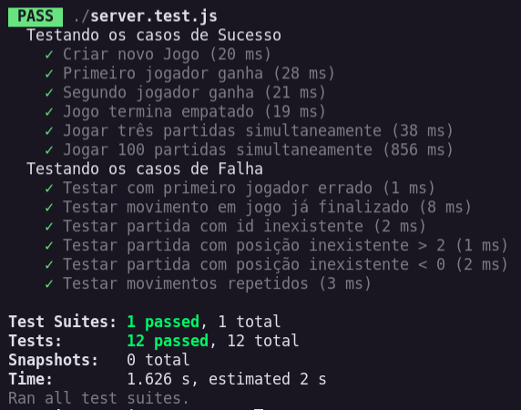

# API Jogo da Velha

## Para executar a aplicação:

    // Primeiramente, faça o clone do respositório.
    // Abra o terminal e digite uma das opções:

    $ git clone git@github.com:ficast/api-jogo-da-velha.git
    $ git clone https://github.com/ficast/api-jogo-da-velha.git
    

    // A porta utilizada é a localhost:3000, certifique-se de que 
    // ela esteja disponível e exeucte o seguinte arquivo no terminal:

    $ ./Run.sh

### Para executar a aplicação manualmente:

    $ npm install
    $ npm start

## Para executar os testes:

    // Certifique-se de que a aplicação esteja sendo executada.
    // Abra um novo terminal e execute o comando:

    $ ./Test.sh
    
### Para executar os testes manualmente:

    // A aplicação deverá estar em execução:
    $ npm start

    // Execute os testes em outro terminal:
    $ npm test

## Dependências utilizadas:

* [Node.js HTTP Module](https://nodejs.org/api/http.html)
* [Express](https://expressjs.com/pt-br/)

* [node-fetch](https://www.npmjs.com/package/node-fetch)
* [body-parser](https://www.npmjs.com/package/body-parser)
* [huid](https://www.npmjs.com/package/uuid)

* [Lodash](https://lodash.com/)
* [Jest](https://jestjs.io/)